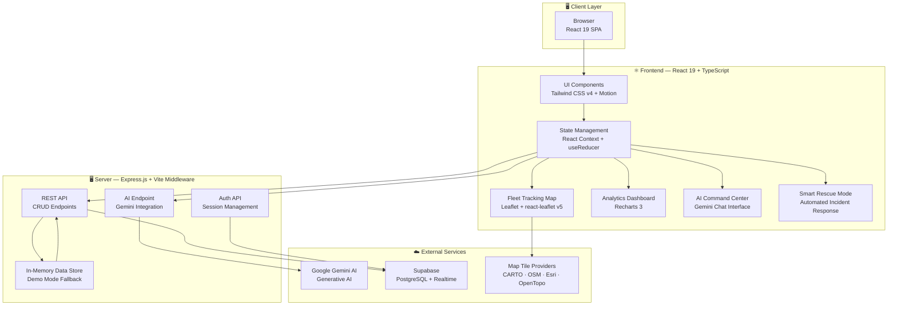
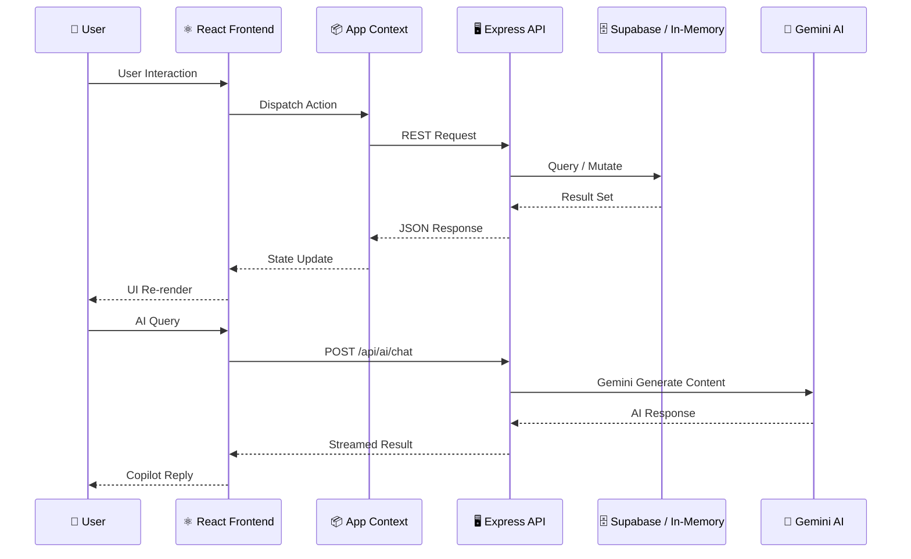

<div align="center">

# 🚚 TransitOps

### Enterprise Fleet & Transport Management Platform

**AI-Powered Logistics · Real-Time Fleet Tracking · Intelligent Dispatch**

[](LICENSE)
[](https://react.dev)
[](https://www.typescriptlang.org)
[](https://vitejs.dev)
[](https://expressjs.com)
[](https://leafletjs.com)
[](https://ai.google.dev)

[Live Demo](#-getting-started) · [Architecture](#-architecture) · [Features](#-features) · [API Reference](#-api-reference)

---

</div>

## 📋 Overview

**TransitOps** is a full-stack, enterprise-grade fleet operations management platform built for modern logistics teams. It unifies real-time vehicle tracking, AI-powered dispatch optimization, driver coordination, maintenance scheduling, and financial analytics into a single, beautifully designed command center.

Powered by **Google Gemini AI**, TransitOps doesn't just track your fleet — it thinks with you. From predicting breakdowns before they happen to auto-generating rescue plans when things go wrong, TransitOps transforms fleet management from reactive chaos into proactive control.

---

## ✨ Features

| Module | Description |
|--------|-------------|
| 🗺️ **Real-Time Fleet Tracking** | Live Leaflet map with multi-layer tiles (Dark/Street/Satellite/Terrain), vehicle trail history, ETA calculations, speed monitoring, geofencing, and vehicle comparison |
| 🤖 **AI Command Center** | Gemini-powered copilot for dispatch optimization, anomaly detection, predictive maintenance alerts, and natural-language fleet queries |
| 🚨 **Smart Rescue Mode** | Automated incident response — detects breakdowns, driver unavailability, cargo overload, license expiry, and generates step-by-step recovery plans with revenue impact |
| 📊 **Analytics & Reports** | Interactive dashboards with Recharts — fleet utilization, revenue trends, fuel efficiency, maintenance costs, ROI tracking, and 7-day trip forecasting |
| 🚗 **Vehicle Directory** | Full fleet registry with health scores, insurance/registration tracking, odometer logs, and status management |
| 👤 **Driver Management** | License validation, safety scoring, fatigue index monitoring, assignment tracking, and automated credential expiry alerts |
| 🔧 **Maintenance Scheduler** | Predictive maintenance logs, scheduled service tracking, mechanic assignment, and cost analysis |
| ⛽ **Fuel & Expense Manager** | Fuel log tracking, per-liter cost analytics, expense categorization, receipt management, and trip-level cost attribution |
| 🛣️ **Trip Dispatcher** | Business-rule-compliant dispatch with cargo weight validation, route planning, priority levels, and real-time progress tracking |
| 🔔 **Notifications & Alerts** | Severity-based alerting system with geofence entry/exit triggers, speeding warnings, route deviation detection, and resolution workflows |

---

## 🏗️ Architecture



### Data Flow



---

## 🛠️ Tech Stack

| Layer | Technology |
|-------|-----------|
| **Frontend Framework** | React 19, TypeScript 5.8 |
| **Build Tool** | Vite 6 with HMR |
| **Styling** | Tailwind CSS v4 (`@tailwindcss/vite` plugin) |
| **Animations** | Motion (Framer Motion v12) |
| **Maps** | Leaflet 1.9.4 + react-leaflet v5 |
| **Charts** | Recharts 3 |
| **Backend** | Express.js 4 with Vite middleware mode |
| **Database** | Supabase (PostgreSQL) with in-memory demo fallback |
| **AI Engine** | Google Gemini SDK (`@google/genai`) |
| **Icons** | Lucide React |
| **Bundler** | esbuild (production server bundle) |

---

## 📸 Screenshots

### Operations Dashboard
Real-time fleet overview with KPI cards, trip charts, vehicle status distribution, and live alerts.

### Fleet Tracking Map
Interactive Leaflet map with live vehicle positions, multi-layer tiles, route trails, ETA calculations, speed indicators, geofences, and active trip monitoring.

### AI Command Center
Gemini-powered copilot for intelligent fleet queries, dispatch optimization, and predictive analytics.

### Smart Rescue Mode
Automated incident detection and recovery plan generation with step-by-step action execution and revenue impact analysis.

---

## 🚀 Getting Started

### Prerequisites

| Requirement | Version |
|------------|---------|
| [Node.js](https://nodejs.org) | v18+ |
| [npm](https://npmjs.com) | v9+ |
| Gemini API Key *(optional for AI features)* | — |

### Installation

```bash
# Clone the repository
git clone https://github.com/Jacksonfio/Transitops.git
cd Transitops

# Install dependencies
npm install

# Configure environment
cp .env.example .env.local
# Edit .env.local and add your Gemini API key (optional)
```

### Environment Variables

| Variable | Required | Description |
|----------|----------|-------------|
| `GEMINI_API_KEY` | For AI features | Google Gemini API key for the AI Command Center |
| `PORT` | No | Server port (default: `3000`) |
| `SUPABASE_URL` | No | Supabase project URL (falls back to demo mode) |
| `SUPABASE_ANON_KEY` | No | Supabase anonymous key (falls back to demo mode) |

### Run Development Server

```bash
npm run dev
```

Open [http://localhost:3000](http://localhost:3000)

| Credential | Value |
|-----------|-------|
| **Email** | `admin@transitops.com` |
| **Password** | `TransitOps@2026` |

### Production Build

```bash
npm run build
npm start
```

---

## 📁 Project Structure

```
Transitops/
├── src/
│   ├── components/
│   │   ├── AICommandCenter.tsx    # Gemini AI chat interface
│   │   ├── AnalyticsReports.tsx   # Recharts dashboards & reports
│   │   ├── DriverLogs.tsx         # Driver management & logs
│   │   ├── ErrorBoundary.tsx      # React error boundary wrapper
│   │   ├── FleetDashboard.tsx     # Main operations dashboard
│   │   ├── FleetTracking.tsx      # Leaflet map + real-time tracking
│   │   ├── FuelExpenseManager.tsx # Fuel logs & expense tracking
│   │   ├── LoginPage.tsx          # Authentication portal
│   │   ├── MaintenanceScheduler.tsx # Maintenance logs & scheduling
│   │   ├── NotificationBell.tsx   # Alert notification system
│   │   ├── SettingsPage.tsx       # App settings & configuration
│   │   ├── Sidebar.tsx            # Navigation sidebar
│   │   ├── SkeletonLoader.tsx     # Loading skeleton components
│   │   ├── SmartRescueMode.tsx    # Automated incident response
│   │   ├── TripDispatcher.tsx     # Trip dispatch & management
│   │   └── VehicleDirectory.tsx   # Vehicle registry & CRUD
│   ├── lib/
│   │   ├── auth.ts                # Authentication utilities
│   │   ├── database.ts            # Supabase database layer
│   │   └── supabase.ts            # Supabase client configuration
│   ├── App.tsx                    # Root application component
│   ├── context.tsx                # Global state (Context + Reducer)
│   ├── data.ts                    # Demo seed data generator
│   ├── types.ts                   # TypeScript type definitions
│   ├── index.css                  # Tailwind CSS + custom theme
│   └── main.tsx                   # Entry point
├── supabase/
│   ├── migrations/
│   │   ├── 001_initial_schema.sql # Database schema
│   │   └── 002_storage_rls.sql    # Row-level security policies
│   └── seed.sql                   # Initial seed data
├── server.ts                      # Express server + API routes
├── vite.config.ts                 # Vite configuration
├── tsconfig.json                  # TypeScript configuration
└── package.json                   # Dependencies & scripts
```

---

## 🌐 API Reference

The Express server exposes REST endpoints at `/api/*`:

| Method | Endpoint | Description |
|--------|----------|-------------|
| `GET` | `/api/vehicles` | List all vehicles |
| `POST` | `/api/vehicles` | Create a vehicle |
| `PUT` | `/api/vehicles/:id` | Update a vehicle |
| `DELETE` | `/api/vehicles/:id` | Delete a vehicle |
| `GET` | `/api/drivers` | List all drivers |
| `POST` | `/api/drivers` | Create a driver |
| `PUT` | `/api/drivers/:id` | Update a driver |
| `DELETE` | `/api/drivers/:id` | Delete a driver |
| `GET` | `/api/trips` | List all trips |
| `POST` | `/api/trips` | Create a trip (with dispatch validation) |
| `PATCH` | `/api/trips/:id/status` | Update trip status |
| `GET` | `/api/geofences` | List all geofences |
| `POST` | `/api/geofences` | Create a geofence |
| `PUT` | `/api/geofences/:id` | Update a geofence |
| `DELETE` | `/api/geofences/:id` | Delete a geofence |
| `POST` | `/api/ai/chat` | Send query to Gemini AI |

---

## 🗺️ Fleet Tracking Features

The real-time tracking module includes:

- **Multi-Layer Map** — Switch between Dark (CARTO), Street (OSM), Satellite (Esri), and Terrain (OpenTopoMap) tiles
- **Vehicle Trail History** — Last 30 GPS positions rendered as fading polylines
- **ETA Engine** — Haversine distance-based ETA calculations updated in real-time
- **Speed Monitoring** — Visual glow/pulse effects for vehicles exceeding 80 km/h
- **Vehicle Comparison** — Select any two vehicles to see the distance between them
- **Idle Detection** — Automatic idle time tracking for stationary vehicles
- **Geofencing** — Create, edit, and delete circular geofence zones with alert triggers
- **Fleet Status Bar** — Color-coded fleet distribution at a glance
- **Toggle Controls** — Show/hide trails, routes, and geofences independently
- **Fullscreen Mode** — Expand the map to fill the entire viewport
- **Speed Unit Toggle** — Switch between km/h and mph display

---

## 🤝 Contributing

Contributions, issues, and feature requests are welcome!

1. Fork the repository
2. Create your feature branch: `git checkout -b feature/amazing-feature`
3. Commit your changes: `git commit -m 'Add amazing feature'`
4. Push to the branch: `git push origin feature/amazing-feature`
5. Open a Pull Request

---

## 📄 License

This project is licensed under the **MIT License** — see the [LICENSE](LICENSE) file for details.

---

<div align="center">

**Built with ❤️ for modern fleet operations teams**

[Report Bug](https://github.com/Jacksonfio/Transitops/issues) · [Request Feature](https://github.com/Jacksonfio/Transitops/issues)

</div>
# 🚚 TransitOps: AI-Powered Fleet & Transport Management

[](https://opensource.org/licenses/MIT)

**TransitOps** is an enterprise-grade, comprehensive fleet operations management platform. Built to streamline logistics, it integrates real-time tracking, vehicle registry management, driver coordination, AI-powered dispatching, and intelligent insights to optimize your transportation network.

## ✨ Features

- **Dashboard & Analytics**: Real-time operational insights via advanced data visualization and fleet utilization tracking.
- **AI-Powered Command Center**: Leverage Gemini AI for an intelligent operations copilot, dispatch optimization, anomaly detection, and predictive maintenance.
- **Vehicle Registry Management**: Track fleet health, registration, insurance schedules, and odometer readings.
- **Driver Management**: Manage assignments, licenses, safety scores, and automated alerts for expiring credentials.
- **Maintenance & Fuel Logs**: Record expenses, log fuel efficiency, and automate maintenance scheduling.
- **Trip Dispatcher**: Ensure business rules compliance before finalizing dispatch, complete with real-time cargo tracking.

## 🛠 Tech Stack

- **Frontend**: React (v19), TypeScript, Tailwind CSS, Lucide Icons, Recharts, Framer Motion
- **Backend Framework**: Express.js with Vite Middleware for SPA
- **AI Integration**: Google Generative AI (Gemini) SDK
- **Build Tool**: Vite & Node.js

## 🚀 Getting Started

### Prerequisites
- [Node.js](https://nodejs.org/en/) (v18 or higher recommended)
- A Gemini API Key for AI features

### Installation

1. **Clone the repository:**
   ```bash
   git clone https://github.com/Jacksonfio/Transitops.git
   cd fleet-and-transport-manager
   ```

2. **Install dependencies:**
   ```bash
   npm install
   ```

3. **Configure Environment Variables:**
   Create a `.env` or `.env.local` file in the root directory and add your Gemini API Key:
   ```env
   GEMINI_API_KEY=your_gemini_api_key_here
   PORT=3000
   ```

4. **Run the Development Server:**
   ```bash
   npm run dev
   ```

5. **Access the Platform:**
   Navigate to `http://localhost:3000` in your browser.
   - **Demo Email:** `admin@transitops.com`
   - **Demo Password:** `TransitOps@2026`

## 🤝 Contributing
Contributions, issues, and feature requests are welcome! Feel free to check the [issues page](https://github.com/Jacksonfio/Transitops/issues).

## 📄 License
This project is licensed under the MIT License - see the [LICENSE](LICENSE) file for details.
